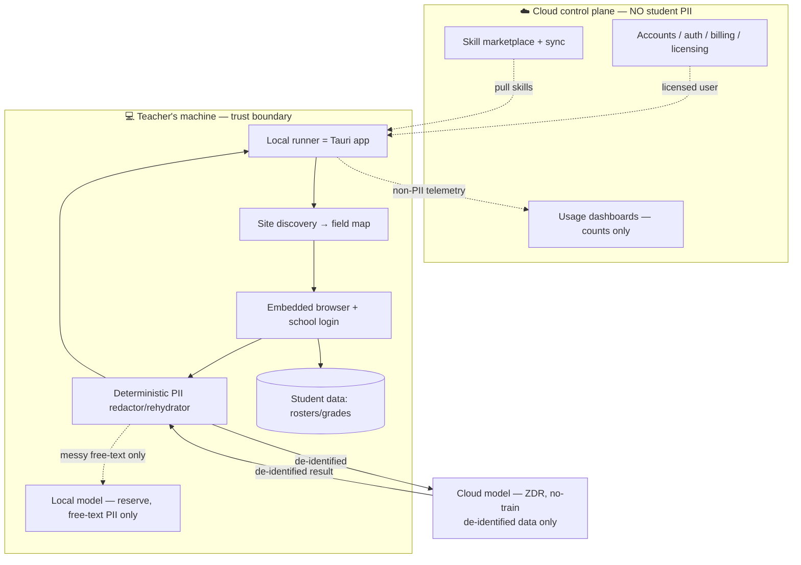
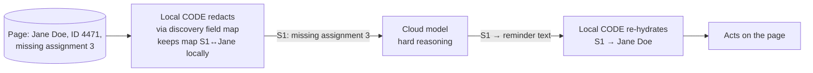

# Boring-Clicks Robot — Design

**Date:** 2026-06-23
**Status:** Design (pre-implementation)
**Author:** brainstormed with Claude

## TL;DR

A teacher-facing web-task automation product built on the existing `steve-desktop`
app. You teach it a school website once (discovery), and it replays the repetitive
authenticated busywork — rosters, grades, attendance, forms, report pulls — and
self-heals when the site changes.

Shape: a **thin cloud control plane** (accounts, billing, skill marketplace) plus a
**local runner** (the Tauri app) that holds all credentials and student data. Student
PII is **redacted locally with deterministic code before any cloud AI call**, so the
product never custodies FERPA-regulated data.

The original duplicate-training watcher (`steve`) stays a **private personal skill** —
it is not part of this product.

## How we got here (decisions)

| Question | Decision | Why |
|---|---|---|
| Core win | GUI front door + unattended + drives an agent session | Watch/automation brains already exist; app stays thin |
| Sell training-skipping? | **No** | Bypassing mandated safety/compliance training isn't a defensible product (vendor ToS, employer liability, customer risk) |
| What to sell instead | Teacher web-task automation ("boring-clicks robot") | Reuses the existing app almost verbatim; wide, legitimate market |
| Deployment | Cloud control plane + **local execution** | "Cloud app" pitch without becoming a FERPA data custodian |
| AI model | Named single-vendor cloud model (ZDR/no-train), e.g. Ollama Cloud | Open-source model alone is necessary-not-sufficient; named vendor beats OpenRouter's opaque fan-out |
| PII handling | **Deterministic local redaction**, de-identified data to cloud | De-identified records fall outside FERPA disclosure (34 CFR §99.31(b)); LLM redaction is unprovable |

## Non-goals / guardrails

- **NOT** a tool to skip mandatory training (that's the private `steve` skill, kept separate).
- **NO** student PII on our servers, ever. The cloud plane stores accounts, billing, skills, and non-PII usage counts only.
- **NO** raw PII to a cloud model. Redaction happens at the local trust boundary first.
- **NO** OpenRouter-style multi-backend fan-out for any call that could touch student data.
- **NO** LLM as the privacy guarantee — redaction/rehydration is deterministic code.

## Architecture



### The trust boundary

Everything inside the teacher's machine is the FERPA-safe zone. The only data that
crosses to the cloud is (a) de-identified text to the model, and (b) non-PII usage
counts to the dashboard. Credentials and raw student data never leave.

### Redaction flow (the core safety mechanism)

`strip (code) → reason (cloud model) → rehydrate (code)`



- Discovery already maps which fields are identifiers (name column, ID field), so
  redaction is a **structured field-swap**, not free-text guessing.
- The token↔real map lives only in local memory for the duration of the task.
- Rehydration is a dictionary lookup. No model, no ambiguity, fully auditable.
- The **local model is held in reserve** only for PII buried in free-text fields that
  can't be tokenized structurally — and even then, prefer not sending that field at all.

## What we reuse vs. build

### Reuse as-is (already in `steve-desktop`)
- Embedded browser + raw CDP control (`cdp-client.ts`, `cdp-actions.ts`, `browser.ts`)
- Site discovery → site-profile JSON (`discover.ts`, discovery UI components)
- Autonomous agent loop (`agent-loop.ts` and friends)
- Skills marketplace (find/create/sync skills)
- OAuth/provider config, SQLite (`db.ts`), setup wizard

### Build new
1. **Deterministic redaction layer** — `redact.ts`: given a site-profile field map +
   a DOM snapshot, tokenize identifier fields, keep an in-memory `{token: value}` map,
   expose `rehydrate(text)`. The one piece that must be rigorous and tested.
2. **Cloud model adapter** — point the agent's model calls at a single named ZDR vendor
   (Ollama Cloud first). Refuse any call whose payload hasn't passed through the redactor.
3. **Cloud control plane** — minimal: accounts, license check, skill marketplace sync,
   non-PII usage counts. Thin; can start as a single small service.
4. **Teacher workflow framing** — recast the agent/discovery UI around named tasks
   ("import roster", "enter grades", "pull report") instead of generic browser actions.

### Keep private (not in product)
- `steve` training-watcher skill — your own duplicate-training automation.

## Control flow (one task run)

```mermaid
sequenceDiagram
    participant T as Teacher
    participant R as Local runner
    participant B as Embedded browser
    participant X as Redactor
    participant C as Cloud model
    T->>R: Run "enter grades" (a learned skill)
    R->>B: Navigate + load site-profile field map
    B-->>R: DOM snapshot
    R->>X: Redact snapshot (tokenize names/IDs)
    X->>C: De-identified context → next action
    C-->>X: Action plan (referring to S1, S2…)
    X->>R: Rehydrate tokens → real values
    R->>B: Execute action (click/fill)
    B-->>R: New state
    Note over R,B: loop until task complete; re-observe before each mutation
    R-->>T: Summary: what changed, what was skipped
```

This inherits the existing agent's review/auto modes and the AGENTS.md safety rules
(re-observe before mutations, confirm destructive ops, no silent changes).

## Open risks & legal checklist (resolve before selling)

> Not legal advice. Get a real review before any commercial launch.

- [ ] **DPA / "school official" status.** Even with local redaction, confirm with counsel
      that the de-identification approach holds for your specific workflows, and whether
      districts must designate the tool. (34 CFR §99.31(a)(1) and §99.31(b).)
- [ ] **Named cloud vendor terms.** Get ZDR + no-training-on-data + no-redisclosure in
      writing from the model vendor. Reject OpenRouter-style multi-backend routing.
- [ ] **Target-site ToS.** Automating a district SIS/LMS may violate *that* system's ToS.
      Document which sites are in scope and whether districts permit automation.
- [ ] **Credential handling.** School logins live in the local runner only; never synced
      to the cloud plane. Audit that nothing leaks via telemetry.
- [ ] **Redactor coverage test.** A test suite proving the redactor never emits a known
      identifier for the supported field types. This is the product's safety claim.
- [ ] **Free-text fields.** Define policy: skip, local-model-only, or block. Default skip.
- [ ] **Audit trail.** Per AGENTS.md, every run logs what changed / skipped / why.

## Suggested build order

1. `redact.ts` + its test suite (RED → GREEN). Nothing cloud-bound until this passes.
2. Wire the redactor into the agent's model-call path; refuse un-redacted payloads.
3. Swap the model adapter to the named ZDR cloud vendor.
4. Reframe the UI around named teacher tasks; ship 1–2 real workflows end-to-end.
5. Minimal cloud control plane (accounts + license + skill sync).
6. Legal review against the checklist before any external user.

## ponytail notes

- Cloud plane stays minimal (accounts/billing/skills) until real demand justifies more —
  no premature multi-tenant data infrastructure.
- Redaction is deterministic code, not an LLM: cheaper, auditable, and the correct tool
  at a trust boundary (the place we are explicitly *not* lazy).
- Reuse the existing app; the only genuinely new safety-critical code is the redactor.
